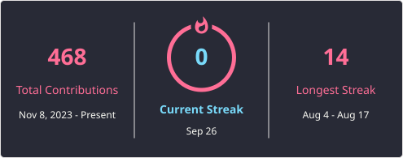

<!-- >  <-->
<!--   -->

<!-- 

  

 -->

###

 

### 🔭 Currently
- Learning offensive security, working through VulnHub boxes
- Building a small home lab
- Building a premium developer portfolio (Next.js + Tailwind)
- EE student & frontend developer, 7+ years of video editing experience

###

  
  
  
  
  
  
  
  
  
  
  
  
  
  
  
  
  
  
  
  
  
  
  
  
  
  
  
  
  

###

  
  
  
  
  
  

###

 

 
  

###

<!-- 

  

 -->

###

  

###

 

<picture align="center">
  <source media="(prefers-color-scheme: dark)" srcset="https://raw.githubusercontent.com/IridescentGlow/IridescentGlow/output/pacman-contribution-graph-dark.svg">
  <source media="(prefers-color-scheme: light)" srcset="https://raw.githubusercontent.com/IridescentGlow/IridescentGlow/output/pacman-contribution-graph.svg">
  
</picture>

###

 

  
⭐ <b>Featured</b>

  
  

 

  

